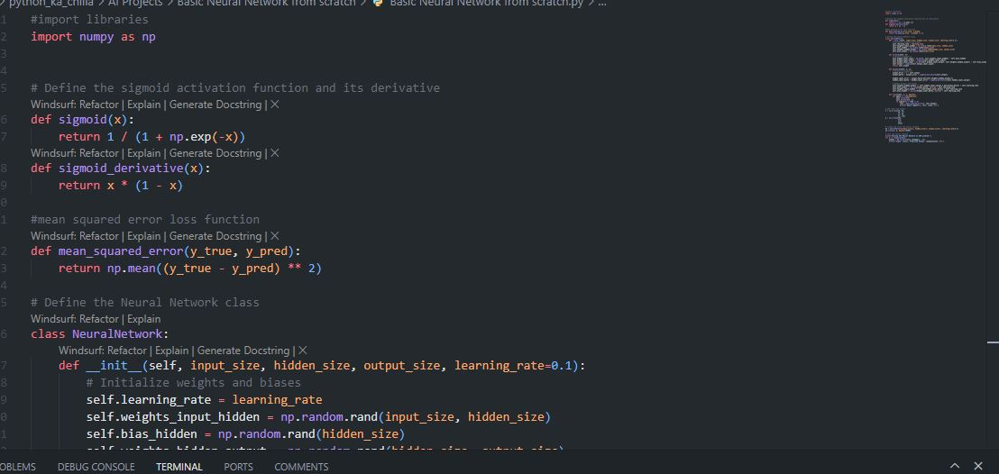
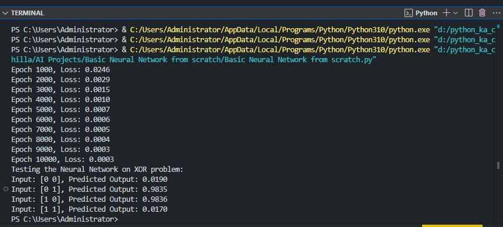

# 🧠 Neural Network from Scratch | XOR Problem Solver 🤖  
   

<p align="center">
  
</p>

🚀 A minimal **neural network implementation from scratch** in Python using only NumPy. This project demonstrates the fundamental mechanics of neural networks by solving the **XOR problem** through backpropagation and gradient descent. Perfect for understanding the inner workings of deep learning without high‑level frameworks.

---

## ✨ Key Features  
🧠 **Pure Python & NumPy** – No deep learning frameworks, just maths  
⚡ **Forward & Backward Pass** – Complete propagation implementation  
📉 **Loss Monitoring** – Tracks mean squared error during training  
🎯 **XOR Solution** – Successfully learns the non‑linear XOR function  
🔧 **Customizable Architecture** – Adjust hidden neurons, learning rate, epochs  
📚 **Educational Code** – Clear, well‑commented code for learning  

---

## 🧠 Tech Stack  
- **Language:** Python 🐍  
- **Numerical Library:** NumPy 🔢  
- **Activation:** Sigmoid  
- **Loss Function:** Mean Squared Error  
- **Optimizer:** Gradient Descent  

---

## 📦 Installation  

```bash
git clone https://github.com/SayabArshad/neural-network-from-scratch.git
cd neural-network-from-scratch
pip install numpy
```
---

## ▶️ Usage

Run the main script:

```bash
python basic_neural_network.py
```
You’ll see the training loss over epochs and the final predictions for all XOR input combinations.

---

## 📁 Project Structure

```
neural-network-from-scratch/
│-- basic_neural_network.py          # Main implementation
│-- requirements.txt                  # Dependencies (numpy)
│-- README.md                         # Documentation
│-- assets/                           # Images for README
│    ├── code.JPG
│    └── output.JPG
```

---

## 🖼️ Interface Previews

|       📝 Code Snippet       |        📊 Console Output        |
| :-------------------------: | :-----------------------------: |
|  |  |

---

## 💡 About the Project

This project builds a feedforward neural network with one hidden layer from absolute scratch. It uses the sigmoid activation function, mean squared error loss, and gradient descent with backpropagation. The XOR problem is a classic benchmark because it is not linearly separable, making it an ideal test for a neural network’s capacity to learn non‑linear patterns. By implementing everything manually, you gain deep insight into how networks really work under the hood.

---

## 🧑‍💻 Author


**Developed by:** [Sayab Arshad Soduzai](https://github.com/SayabArshad) 👨‍💻

📅 **Version:** 1.0.0

📜 **License:** MIT License

---

## ⭐ Contributions

Contributions are welcome! Fork the repository, open issues, or submit pull requests to add features like:

More hidden layers

Different activation functions (ReLU, tanh)

Batch training

Momentum optimization
If you find this project helpful, please ⭐ star the repository to show your support.

---

## 📧 Contact

For queries, collaborations, or feedback, reach out at **[sayabarshad789@gmail.com](mailto:sayabarshad789@gmail.com)**

---

🧠 Understanding neural networks one line of code at a time.
